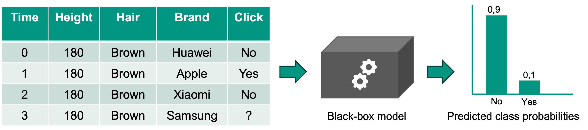
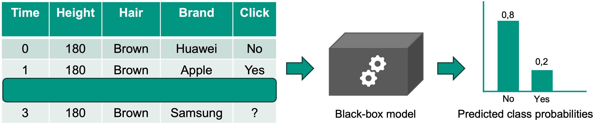
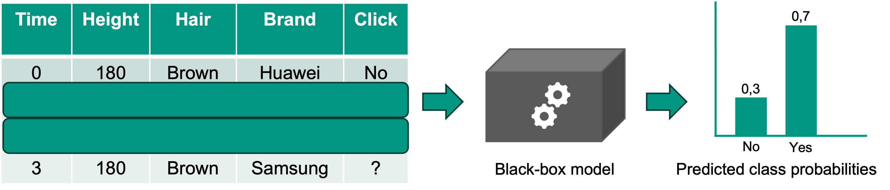

# Explainable Time Series

This repository contains the code for the seminar thesis "Explainable Time Series". 

## Motivation

In summary, the motivation behind this thesis stems from two main issues related to the explainability of time series data. Firstly, conventional methods such as SHAP fail to provide satisfactory explanations due to their assumption of independence which is violated for timeseries. Secondly, there is a practical demand for more fine-grained explanations in the context of time series analysis. Recognizing these limitations, this seminar thesis aims to develop and explore a model-agnostic approach for the post-hoc explanation of time series data. 

## Approach
Let $\phi(x_\tau|x_0,...x_{\tau-2},x_{\tau-1})$ be the predicted class probability (or predicted value for regression problems) in timestep $\tau$, given the feature vectors $x$ of the previous timesteps $t=0,...,\tau-1$. Then the importance of timestep $t=\tau-1$ is given by the following equation:

$ I(x_{\tau-1}) = |\phi(x_\tau|x_0,...,x_{\tau-2},x_{\tau-1}) - \phi(x_\tau|x_0,...,x_{\tau-2})|$

Since the variable $x_k$ is assumed to be the only dynamic variable in the feature vector $x = (x_1, \ldots, x_k, \ldots, x_n)$, the importance of the timestep $t=\tau-1$ equals the importance of the observed value of the feature $x_k$ in that timestep. 

## Example
To further illustrate the calculation of our approach, we give an example using a binary classification problem. Given the customer data of clicks (binary target variable) on different brand ads (dynamic categorical variable) for $t=4$ timesteps as well as height and hair color of the customer (static continuous and categorical variables), we want to calculate the importance of the observed brands for the prediction made by a black-box model.  

Using the equation above, we can calculate the importance of each brand by successively omitting the timesteps, as depicted in Figure \ref{example} below. For timestep $t=2$ this results in $I(x_{2}) = | \phi(x_3|x_0,x_1,x_2) - \phi(x_3|x_0,x_1) | = |0.1-0.2| = 0.1$ which equals the importance of the brand Xiaomi being observed, since brand is the only dynamic variable. Analogously the importance of the brand Apple being observed can be calculated by $I(x_{1}) = |\phi(x_3|x_0,x_1) - \phi(x_3|x_0)| = |0.2 - 0.7| = 0.5$. Note that $\phi(x)$ stands for our model's predicted probability of a Yes in the target variable.  

## Datasets

### 1) Taobao Click Dataset
We evaluate our approach on the publicly available click dataset from Taobao, available on Kaggle: https://www.kaggle.com/datasets/pavansanagapati/ad-displayclick-data-on-taobaocom  

The implementation and evaluation of our approach can be found in [here](explainable_ts.iypnb). The preprocessing happens [here](preprocessing.ipynb) and an exploratory data analysis (EDA) of our preprocessed data is conducted [here](eda.ipynb)  

outdated, first implementations can be found inside this [folder](old)

### 2) Synthetic Dataset
To address the limitations of the click dataset, we generate a synthetic dataset and evaluate our approach on it as well. This can all be found [here](synthetic.ipynb)